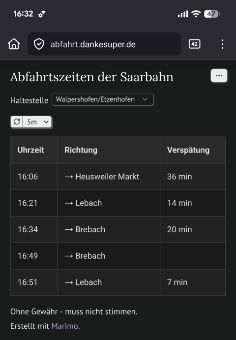

# Sad but true

Das Durcheinander des Saarbahn-Fahrplans - einfach dargestellt

Ein einfaches Marimo-Notebook, das die Abfahrtszeiten der Saarbahn (plus Verspätung hrhr) anzeigt.

Benutzt die [https://v6.db.transport.rest](https://v6.db.transport.rest) REST API für das Öffentliche Verkehrssystem in Deutschland.
Idee [https://stb.brightel.uk](https://stb.brightel.uk).
